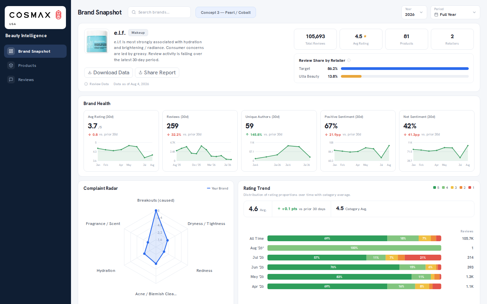

# Samuel Choi — Data Science & Intelligence Portfolio

**Two production data products demonstrating predictive ML, NLP / information extraction, statistical evaluation, analytics engineering, and MLOps.**

[Baseball Intelligence](projects/baseball/README.md) · [Beauty Intelligence](projects/beauty-intelligence/README.md) · [Baseball live product](https://baseball.nyx-aether.com) · [Beauty live product](https://beauty-intelligence-seven.vercel.app)

The full production repositories remain private. This public repository is the hiring-facing layer: methodology, architecture, evaluation discipline, verified results, product evidence, and the decisions I can defend in an interview.

---

## Product previews

These are current shipped product surfaces captured from the live products, not mockups. The technical case studies below explain the data and evaluation systems behind them.

| NYX Aether — Baseball Intelligence | Beauty Intelligence |
|---|---|
|  | [](https://raw.githubusercontent.com/NyxAetherCtrl/nyx-aether-showcase/main/assets/beauty/beauty-production-brand-snapshot.png) |
| Live MLB slate, model context, and game intelligence | Current production Brand Snapshot: brand health, complaint, rating, pricing, and portfolio signals |

## 30-second recruiter scan

| Area | Evidence in this portfolio |
|---|---|
| **Predictive ML** | Binary classification, L2-regularized logistic regression, feature engineering, calibrated win probabilities |
| **NLP / Semantic Analytics** | Multi-label concept extraction, taxonomy design, evidence spans, negation/context handling, sentiment/assertion semantics |
| **Experimentation & Evaluation** | Champion–challenger testing, paired model evaluation, walk-forward validation, holdout governance, blind human annotation |
| **Statistics** | Log loss, Brier score, AUC, ECE, bootstrap confidence intervals, paired/cluster bootstrap, sign testing, macro-F1, confusion matrices |
| **Time-aware Data Science** | Point-in-time features, look-ahead bias prevention, out-of-time testing, longitudinal concept rollups |
| **Analytics Engineering** | Explicit denominators, cohort design, support thresholds, metric semantics, time-series aggregation |
| **Data Engineering** | Python, SQL, PostgreSQL/Supabase, multi-source ingestion, incremental pipelines, idempotency, reconciliation, data-quality tests |
| **Production ML / Data Products** | Model versioning, shadow evaluation, feature gating, CI/CD, monitoring, rollback, Next.js/Vercel product delivery |

### Roles this portfolio is designed to support

**Data Scientist · Product / Growth Data Scientist · Applied Data Scientist · Analytics Engineer · ML-adjacent Data Product roles**

The strongest fit is for roles that value not only modeling, but also **experimental design, data quality, metric correctness, reproducibility, and shipping analytical systems into production**.

---

## Featured projects

| Project | Core DS problem | Strongest hiring signals |
|---|---|---|
| ⚾ **[NYX Aether — Baseball Intelligence](projects/baseball/README.md)** | Estimate pregame MLB win probability using only information available at prediction time | Predictive ML · temporal validation · calibration · statistical inference · champion–challenger evaluation · MLOps |
| ◇ **[Beauty Intelligence](projects/beauty-intelligence/README.md)** | Convert noisy consumer reviews into defensible product, complaint, brand, and market intelligence | NLP / information extraction · taxonomy engineering · human-ground-truth evaluation · time-series analytics · metric design · B2B data product |

The domains are intentionally different. Baseball tests whether I can build a **forward-looking probabilistic model without leaking the future**. Beauty Intelligence tests whether I can turn **unstructured language into stable, auditable business signals**.

Both follow the same end-to-end pattern:

```text
raw external data
      ↓
data acquisition + quality controls
      ↓
feature / semantic representation
      ↓
model or analytical engine
      ↓
evaluation with explicit cohorts and denominators
      ↓
versioned production pipeline
      ↓
user-facing decision product
      ↓
monitoring, error analysis, iteration
```

---

## Data Science skill map

| Skill | Baseball Intelligence | Beauty Intelligence |
|---|---|---|
| **Problem Framing** | Pregame win probability under strict information-time constraints | Review text → product / complaint / brand intelligence |
| **Supervised ML** | Binary classification with L2 logistic regression | — |
| **NLP / Information Extraction** | — | Multi-label concept extraction with supporting evidence spans |
| **Feature / Representation Engineering** | Rolling form, run differential, season strength, rest, home-field, point-in-time signals | Versioned concept taxonomy, phrase/context rules, sentiment/assertion states |
| **Temporal Validation** | Walk-forward train → validation → test; out-of-time holdout | Time-indexed review aggregation and trend windows |
| **Leakage Prevention** | Point-in-time reconstruction, immutable pregame records, ingest-time controls | Prediction-hidden annotation, versioned semantic tables, frozen evaluation identity |
| **Calibration** | Identity, Platt scaling, isotonic regression; validation-only selection | — |
| **Statistical Inference** | Bootstrap CIs, paired bootstrap, date-cluster bootstrap, sign test | Slice-based error analysis and human-ground-truth evaluation design |
| **Experiment / Version Evaluation** | Engine 2.2 vs 3.0 champion–challenger paired benchmark | V2/V3 side-by-side semantic-engine validation with feature gates |
| **Human Ground Truth** | Final game outcomes provide objective labels | Blind annotation with representative + challenge cohorts |
| **Evaluation Metrics** | Log loss, Brier, AUC, ECE, accuracy | Concept detection, span IoU/exact match, sentiment/assertion accuracy, macro-F1, confusion matrices |
| **Cohort / Sampling Design** | Same-game paired eligibility, date-aware evaluation cohorts | Proportional stratification plus targeted challenge-set sampling |
| **Time-Series Analytics** | Rolling historical windows, prospective grading | Monthly concept/sentiment rollups, emerging-signal analysis |
| **Metric Design** | Proper scoring rules and cohort-matched comparison | Review-level denominators, distinct-review counting, support thresholds, typed unavailable states |
| **Data Engineering** | Multi-source ingestion, append-only history, deterministic pagination, reconciliation | Multi-retailer collection, incremental tagging, dirty-window rollups, idempotent recovery |
| **Production / MLOps** | Model artifacts, shadow challenger, production authority, monitoring, rollback | Persisted semantic layer, V2/V3 isolation, read gates, rollback boundaries |

### Skills I can defend in an interview

**Machine Learning & Statistics**  
Binary Classification · Logistic Regression · L2 Regularization · Feature Engineering · Probability Calibration · Platt Scaling · Isotonic Regression · Model Selection · Bootstrap Confidence Intervals · Paired Model Evaluation · Statistical Significance · Error Analysis

**Experimentation & Evaluation**  
Champion–Challenger Testing · Walk-Forward Validation · Out-of-Time Testing · Prospective Validation · Holdout Governance · Stratified Sampling · Challenge Sets · Human-in-the-Loop Evaluation · Macro-F1 · Confusion Matrices · Span IoU

**NLP & Consumer Intelligence**  
Information Extraction · Multi-Label Concept Tagging · Taxonomy / Ontology Design · Negation & Context Handling · Sentiment Analysis · Assertion Classification · Evidence Extraction · Complaint Intelligence · Trend Detection

**Analytics & Data Engineering**  
Python · SQL · PostgreSQL · Supabase · ETL / ELT · Incremental Pipelines · Idempotency · Data Lineage · Point-in-Time Data · Data Quality Testing · Metric Semantics · Denominator Design · Time-Series Aggregation

**Production**  
MLOps · Model Versioning · Shadow Evaluation · Feature Gating · CI/CD · GitHub Actions · Cloudflare Workers · Vercel · Next.js · TypeScript · Monitoring · Reproducible Pipelines

> **Deliberate non-claims:** Baseball Engine 2.2 vs 3.0 is not called an A/B test because games were not randomly assigned to treatments. Beauty Intelligence does not claim human-validated semantic accuracy before blind human ground truth supports it. I would rather label an experiment correctly than add a stronger-sounding keyword.

---

# Project 1 — NYX Aether Baseball Intelligence

[**Open the full Baseball case study →**](projects/baseball/README.md)

A production MLB analytics and forecasting platform built around one requirement: **every forecast must be reproducible from information that actually existed before first pitch.**

### Hiring signal

- Built a probabilistic binary-classification pipeline for MLB game outcomes.
- Designed **point-in-time feature engineering** and walk-forward validation to prevent look-ahead bias.
- Compared identity, Platt, and isotonic **probability calibration** using validation-only evidence.
- Evaluated predictions with **log loss and Brier score** as proper scoring rules, plus AUC, ECE, and accuracy.
- Built a **paired champion–challenger benchmark** so Engine 2.2 and Engine 3.0 are evaluated on identical games.
- Quantified uncertainty with bootstrap confidence intervals instead of promoting from point estimates alone.
- Operated prospective scoring, grading, versioning, monitoring, rollback, and cloud scheduling.

### Interview result

The strict historical benchmark contained **120 paired games across 9 dates**. Engine 3.0 improved log loss and Brier score directionally, but the paired 95% confidence intervals crossed zero. The published conclusion stayed **“directionally better, not statistically established.”**

The benchmark also exposed nondeterministic pagination in its own evaluation harness. I invalidated the first result, repaired the data-ordering contract, reproduced the cohort, and reran the comparison rather than keeping a favorable but untrustworthy result.


**Deep dives:** [Architecture](docs/ARCHITECTURE.md) · [Technical case study](docs/TECHNICAL_CASE_STUDY.md) · [Data engineering](docs/DATA_ENGINEERING.md) · [Model evaluation](docs/MODEL_EVALUATION.md)

---

# Project 2 — Beauty Intelligence

[**Open the full Beauty Intelligence case study →**](projects/beauty-intelligence/README.md)

A production consumer-review intelligence platform that turns unstructured beauty reviews into structured concepts, complaint evidence, product signals, brand comparisons, and longitudinal trends.

### Hiring signal

- Designed a domain taxonomy and **multi-label information-extraction** layer for beauty-review language.
- Added phrase context, negation, assertion state, sentiment, and evidence spans instead of treating keyword matches as truth.
- Materialized review-level semantic mentions and monthly rollups so analytics pages consume persisted evidence rather than rerunning text interpretation per request.
- Built complaint ranking, peer benchmarking, product-family aggregation, and explicit **metric-denominator rules**.
- Designed a **blind human-ground-truth evaluation system** with representative and challenge cohorts.
- Evaluation supports concept detection, span exactness/IoU, macro-F1, confusion matrices, and strict end-to-end correctness.
- Built V2/V3 side-by-side data paths and feature gates so a new semantic engine can be evaluated and rolled back safely.

### Interview result

The strongest story is not a headline accuracy number. It is the decision to **withhold an accuracy claim until blind human labels establish it**, while still building the full annotation, cohort, adjudication, and evaluation infrastructure needed to measure it correctly.

That demonstrates a different DS skill from Baseball: defining what should count, designing ground truth, protecting denominators, and translating noisy language into business metrics without collapsing query failure, low sample size, and true zero into the same value.

[](https://raw.githubusercontent.com/NyxAetherCtrl/nyx-aether-showcase/main/assets/beauty/beauty-production-brand-snapshot.png)

*The current production Brand Snapshot combines review coverage, brand health, complaint incidence, rating distribution, price positioning, and portfolio-level signals in one decision surface. Click the image to open the full-page capture directly.*

---

## What makes these projects credible

- **Production systems, not notebook-only demos.** Both projects connect methodology to live user-facing products.
- **Evaluation is designed before promotion.** Model/engine changes are compared under explicit cohorts and acceptance rules.
- **Failures become tests.** Pagination, encoding, collection, denominator, and availability failures were converted into regression guards.
- **Metrics keep their denominators.** Comparisons are not presented as apples-to-apples when their cohorts differ.
- **Source remains private by design.** This repository exposes enough methodology to evaluate the work without publishing credentials, raw review data, operational runbooks, or complete model/engine internals.

---

## Tech stack

**Python** · **SQL** · **PostgreSQL / Supabase** · **pandas** · **scikit-learn** · **pytest** · **TypeScript** · **Next.js / React** · **GitHub Actions** · **Cloudflare Workers** · **Vercel**

---

## About

Designed, built, and operated by **Samuel Choi**. These projects demonstrate end-to-end capability across **data science, product analytics, analytics engineering, and production ML/data products** — from raw data and problem definition through evaluation and production delivery.

AI coding tools were used as implementation accelerators. Problem framing, architecture, data definitions, evaluation policy, acceptance criteria, and production decisions are represented here as explicit, testable system contracts rather than as tool-generated claims.
