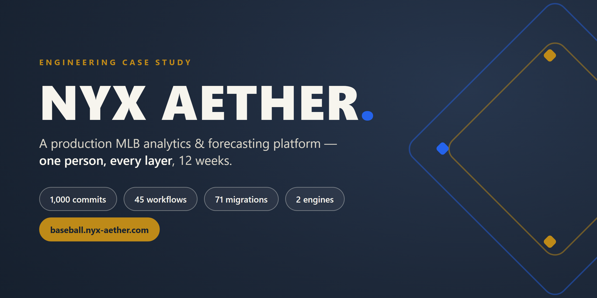
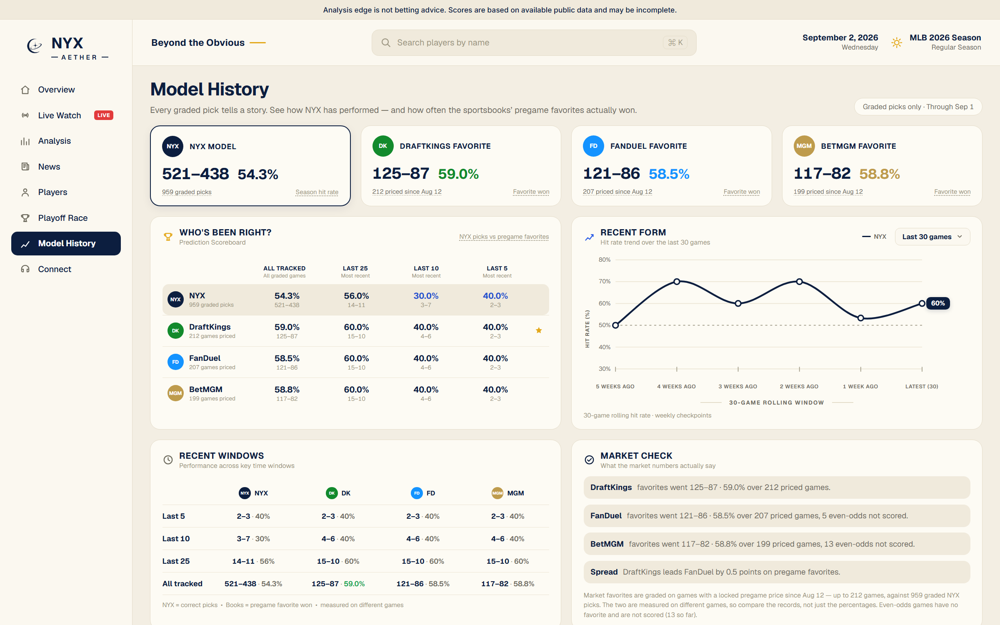
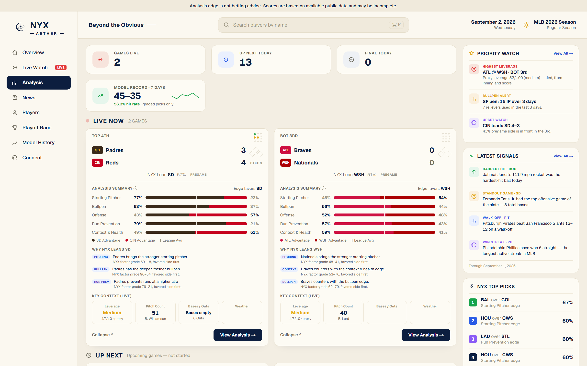
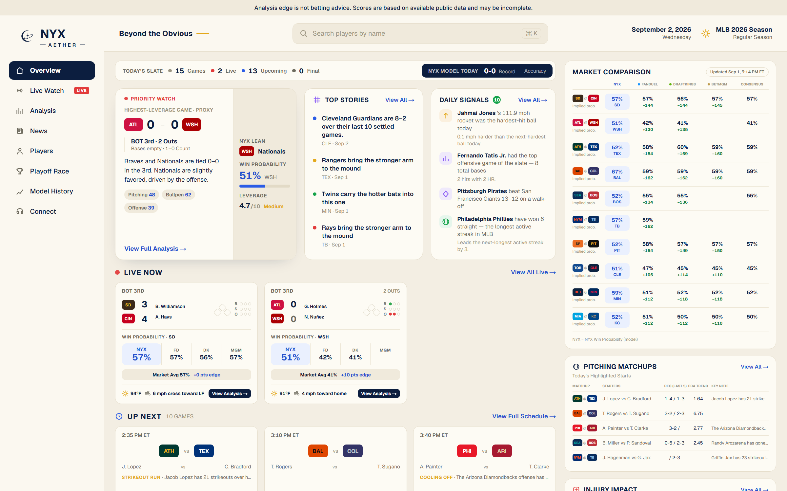
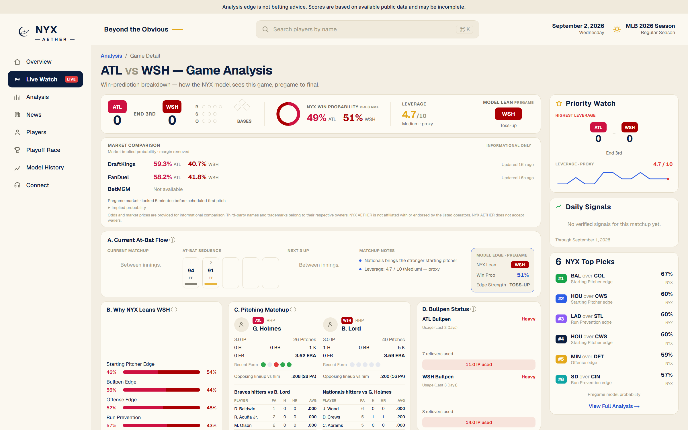
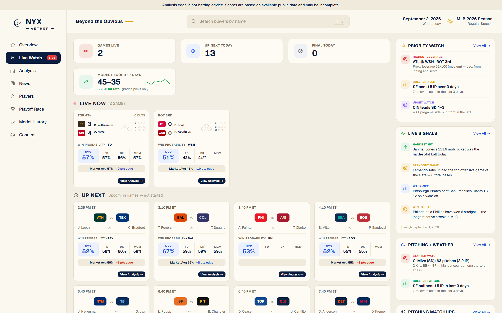

# NYX Aether — Baseball Intelligence Platform

A production MLB analytics and forecasting platform — designed, built, and operated end-to-end by one person in 12 weeks. Six external sources feed a Postgres warehouse with database-enforced temporal integrity. Two prediction engines run under frozen evaluation protocols. A Cloudflare Worker owns all scheduling, because the default scheduler measurably dropped half its fires. The public product grades its own forecasts in the open.

**Live product:** [baseball.nyx-aether.com](https://baseball.nyx-aether.com)

**This repository is the engineering case study.** The product's source is private (see [Source availability](#source-availability--data-use)); this repo documents the architecture, the hard problems, and the evidence discipline behind them.

| | |
|---|---|
| [Architecture](docs/ARCHITECTURE.md) | System design: sources → pipelines → warehouse → serving, and the orchestration rail |
| [Technical case study](docs/TECHNICAL_CASE_STUDY.md) | Five production problems: silent data loss, unreliable schedulers, forecast integrity, point-in-time correctness, evaluation governance |
| [Data engineering](docs/DATA_ENGINEERING.md) | Ingestion, idempotency, freshness, identity resolution, and the failure modes that shaped them |
| [Model evaluation](docs/MODEL_EVALUATION.md) | How the models are measured, what the numbers actually are, and the rules that prevent overclaiming |
| [Project evolution](docs/PROJECT_EVOLUTION.md) | Eight stages from first commit to operated production system |

---

## What I built

NYX Aether answers a simple product question — *who is likely to win tonight, and why?* — with an uncompromising constraint: every number shown to a user must be explainable, timestamped, and reproducible after the fact. That constraint, not the baseball, is what made the system hard.

- **Data platform.** Python pipelines ingest game schedules, box scores, pitch-level Statcast data, sportsbook odds, prediction-market prices, and stadium weather from six external sources into Supabase Postgres — with retries, freshness tracking, idempotent writes, and reconciliation passes that heal gaps instead of assuming clean runs.
- **Warehouse with guarantees.** 71 SQL migrations define ~96 tables. Twelve of them are append-only, enforced by database triggers that refuse `UPDATE`/`DELETE` for every role — historical facts cannot be rewritten through any database role, including the pipelines' own service role.
- **Two engines, asymmetric authority.** A transparent pillar-based engine with calibrated probabilities publishes the forecast of record. A machine-learned challenger runs in shadow mode against it — its writer cannot reach production tables, and it is evaluated under preregistered, frozen protocols.
- **Public accountability.** The product publishes its own win–loss record on every graded forecast, alongside sportsbook favorites' records on their own cohorts — with an explicit "compare the records, not just the percentages" explanation, because the cohorts differ.
- **The product itself.** A Next.js 15 app — live scores, game analysis, player pages, playoff odds, and a model history page — in four languages, on a read-only API surface.

## Architecture

The unusual part is the **orchestration rail**. GitHub Actions is the compute runtime, but not the timing authority: a Cloudflare Worker dispatches the scheduled workflows on the minute, labels every dispatch with a slot identity, and dedupes so each slot runs exactly once. The split was validated by measurement — bare GitHub cron, instrumented over three days on a production workflow, missed 8 of 15 scheduled fires, with a median delay of 121 minutes and a worst case of 479. Downstream jobs derive their work from the schedule slot, not the wall clock, so a delayed run still processes the right slate. Details in [ARCHITECTURE.md](docs/ARCHITECTURE.md) and [case study #2](docs/TECHNICAL_CASE_STUDY.md#2-scheduling-on-infrastructure-that-misses-half-its-alarms).

## Engineering highlights

1. **A write-once forecast archive.** I caught upserts silently rewriting "pregame" win probabilities after games started — 33 of 60 archived values had drifted from what was first captured, which would have quietly corrupted every evaluation metric. The fix: an insert-only archive behind a unique lock, verified by checksum audits — and a doctrine that hardened into the 12 trigger-enforced append-only tables. ([Case study #1](docs/TECHNICAL_CASE_STUDY.md#1-the-forecast-of-record))
2. **Silent truncation, found and fenced.** The Postgres REST layer caps responses at ~1,000 rows without an error. Four production readers were consuming truncated data — one table had 14,825 rows, and the *newest* rows were the ones dropped. Fix: a paged reader with a deterministic total order, plus a CI regression suite that simulates the truncation behavior so the bug class can't return. ([Case study #3](docs/TECHNICAL_CASE_STUDY.md#3-the-database-was-silently-lying))
3. **Point-in-time correctness compiled into the schema.** Three separate clocks per observation (what the source claimed, when it was observed, when the row was written). Content-addressed primary keys whose hashes are recomputed by `CHECK` constraints in-database. A sportsbook closing line locked 5 minutes before first pitch as a pure function of append-only snapshots — with the deadline arithmetic itself a `CHECK` constraint. ([Case study #4](docs/TECHNICAL_CASE_STUDY.md#4-point-in-time-correctness-as-a-schema-property))
4. **Evaluation governance that cannot overclaim.** Split policy, metrics, and holdout seasons were frozen as hashed contracts before training; the out-of-time validation was preregistered, executed once, and recorded as consumed; the live comparison ledger refuses directional claims below its minimum-evidence threshold. ([Case study #5](docs/TECHNICAL_CASE_STUDY.md#5-evaluation-governance-that-cannot-overclaim))
5. **A benchmark that caught its own bug.** The engine-comparison harness found non-determinism in its own reads, invalidated its first result, re-ran to bit-exact reproduction — and still published its verdict as "not statistically established." ([MODEL_EVALUATION.md](docs/MODEL_EVALUATION.md))
6. **Fail-closed publication.** The cloud writer that publishes official forecasts runs from a SHA-pinned workflow behind a code-identity preflight that refuses to publish if the checkout diverges from the pinned revision; after the publish chain, liveness and coverage verification fails the run loudly if the official surface is unhealthy.
7. **A byte-level encoding guard with a self-test.** After a shell round-trip corrupted seven merged files while every test stayed green, I wrote a stdlib-only guard that scans for corruption byte patterns — and its CI job first proves the guard *can still fail* before trusting its PASS.
8. **A semantic layer for metrics.** Every pipeline is declared in a frozen registry (builder, validator, backfill, owner, status); shared statistical formulas live in one registry with denominator guards and null handling, verified byte-identical to the inline math they replaced before adoption.

## Data & modeling, with denominators

The modeling story is deliberately unglamorous, because MLB game outcomes are close to coin flips and pretending otherwise collapses in front of anyone who knows the domain.

- Walk-forward out-of-sample AUC for the platform's machine-learned model line rose stepwise toward a documented practical ceiling of ~0.58–0.60 for this problem; each step had to earn its place out-of-sample. Figures, per-step attribution, and calibration evidence in [MODEL_EVALUATION.md](docs/MODEL_EVALUATION.md).
- The production engine's public record at time of writing: **521–438 (54.3% ± 3.2pp at 95%) on 959 graded picks**. Sportsbook favorites over a recent overlapping window win ≈58.5–59.0% *of their own priced cohorts* — a different denominator, which the product says out loud instead of burying.
- The experimental engine has **no production authority** — its writer cannot reach official tables, its output renders only under explicit candidate labeling, and a repository test sweeps the user-facing tree to prove no experimental output leaks into the product. (Mechanisms in [MODEL_EVALUATION.md](docs/MODEL_EVALUATION.md).)

## Production & reliability

- **45 GitHub Actions workflows**: 16 CI gates, 16 scheduled data pipelines, 6 engine pipelines, a monitor, and manual tools.
- **Observability as a wrapper**: every pipeline run records run metadata and data freshness together, and failure never advances freshness.
- **Idempotency everywhere**: keyed upserts, healing lookbacks, and set-based reconciliation make repeated or overlapping runs harmless ([DATA_ENGINEERING.md](docs/DATA_ENGINEERING.md)).
- **Read-only serving surface**: 27 GET-only API routes, no server actions — the web tier cannot mutate anything ([ARCHITECTURE.md](docs/ARCHITECTURE.md)).
- **Incidents become gates**: the failure classes that actually occurred — encoding corruption, pagination truncation, language drift, label leakage — each run as blocking CI checks ([DATA_ENGINEERING.md](docs/DATA_ENGINEERING.md#testing)).

## The product

The public app at [baseball.nyx-aether.com](https://baseball.nyx-aether.com) — server-rendered, four languages (EN/JA/ES/KO), designed to be readable by a casual fan in about ten seconds per screen. Every screen carries the product's standing disclaimer: analysis, not betting advice.

| | |
|---|---|
|  |  |
| **Model History** — the model grades itself in public: every pick, wins and losses alike, beside the market's record on its own cohort | **Analysis** — the daily slate with explanatory factors: why the model leans where it leans |
|  |  |
| **Overview** — today's slate with win probabilities and model context | **Game Center** — per-game matchup detail, factors, and live state |

 <b>Live</b> — in-progress scores with adaptive polling; market probabilities appear beside the model's as labeled context, not advice

## Tech stack

**Python** (pipelines, engines, evaluation) · **PostgreSQL / Supabase** (warehouse, RLS, triggers as guarantees) · **TypeScript / Next.js 15 / React 19 / Tailwind** (product) · **GitHub Actions** (compute + CI) · **Cloudflare Workers** (timing authority) · **Vercel** (serving) · pandas, scikit-learn, pybaseball, pytest (3,137 test functions), node:assert (96 web test files, zero test-framework dependencies)

## By the numbers

All figures measured from the production repository at the time of writing (September 2026).

| | |
|---|---|
| Timeline | 12 weeks (June 10 – September 2, 2026), solo |
| History | 1,000 commits, 438 merged pull requests |
| Pipelines | ~84.5k lines of Python + ~43.5k lines of tests |
| Database | 71 migrations, ~96 tables, 12 append-only under trigger enforcement |
| Automation | 45 GitHub Actions workflows + a Cloudflare Worker dispatcher |
| Product | 71 routes, 263 React components, 27 read-only API endpoints, 4 languages |

## Project evolution

The system was promoted, not launched: the first engine went to production behind a config flag five days after the first commit, and every major transition since (engine v2.2, the V3 UI, the cloud writer cutover) shipped with a tested rollback path. The eight stages — including the failures that reshaped the architecture — are in [PROJECT_EVOLUTION.md](docs/PROJECT_EVOLUTION.md).

## Source availability & data use

- **The production source is private.** It contains operational configuration and model internals that are not appropriate to publish. This case-study repo is the public artifact: architecture, decisions, tradeoffs, and verified numbers — no fabricated code samples (anything illustrative is labeled as simplified pseudocode).
- **Data use.** The platform consumes free, publicly accessible data (MLB Stats API, Statcast via pybaseball, The Odds API, Kalshi, Open-Meteo, NOAA) for research and demonstration. It is an independent project, not affiliated with or endorsed by MLB or any data provider. The product presents explainable sports intelligence — it does not offer betting advice, and a CI gate enforces that stance in all four languages.
- **Method.** Built solo, with AI coding tools in the loop for implementation speed. The guardrails are mechanical, not aspirational: every change through a pull request (438 merged), blocking CI for previously observed failure classes, immutability and access rules enforced in the database, and evaluation protocols that bind the author too.

## About

Designed, built, and operated by **Samuel Choi** — targeting data science, analytics engineering, and ML-adjacent product roles. Contact via [GitHub profile](https://github.com/NyxAetherCtrl). This project is my answer to "what does production-grade look like when one person owns every layer?"
