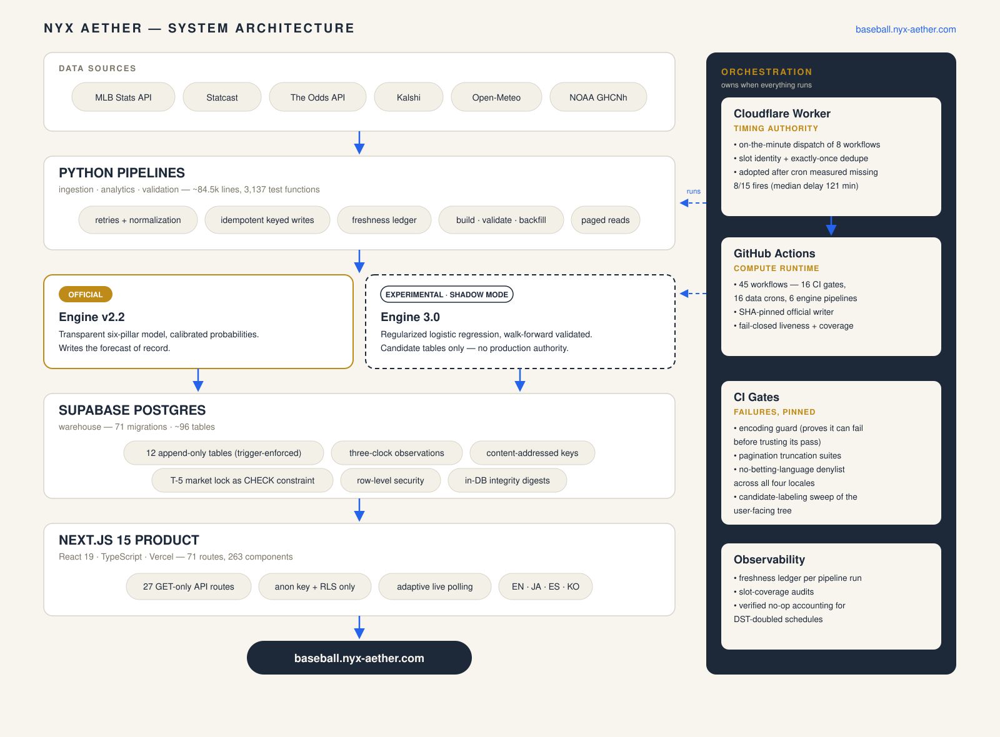

# Architecture

NYX Aether is a five-layer system: external data sources feed Python pipelines, which land in a Supabase Postgres data platform, which serves two prediction engines and a Next.js product — with an orchestration rail alongside that owns *when* everything runs.

## Design principles

Three rules shaped every layer:

1. **Guarantees live in the lowest layer that can enforce them.** Immutability is a database trigger, not a code review comment. Read-only serving is the absence of mutation routes, not a permission check.
2. **Time is data.** Every observation records what the source claimed, when it was observed, and when it was written. Point-in-time replay is a first-class query, because the models must train on "what was known then."
3. **Assume silent failure.** Schedulers drop fires, REST layers truncate without errors, shells corrupt bytes. Each layer is wrapped so partial success is either impossible or loud.

## Layer 1 — Data sources

Six external sources, all free/public tiers, all wrapped in dedicated clients:

| Source | Provides |
|---|---|
| MLB Stats API | Schedules, box scores, line scores, rosters, standings, transactions |
| Statcast (via pybaseball) | Pitch-level and batted-ball data |
| The Odds API | Sportsbook moneylines across books |
| Kalshi | Prediction-market prices |
| Open-Meteo | Stadium weather forecasts |
| NOAA GHCNh | Historical hourly weather observations |

Clients share a pattern: persistent sessions, timeouts, retry with exponential backoff, and normalization of raw payloads into flat row dictionaries at the boundary — so everything past the client layer speaks one schema dialect. Sportsbook API quota is budgeted explicitly (free-tier request accounting is a design input, not an accident).

## Layer 2 — Pipelines (Python)

A layer built for correctness under repetition — every dataset declared, every builder independently recomputed, every run's freshness earned rather than assumed.

- **A pipeline registry as the single source of truth.** Every dataset is declared in a frozen manifest: its builder, validator, backfill entry point, source, owner, status (production / candidate / planned), and schedule. "What pipelines exist" is a queryable fact, not tribal knowledge.
- **A shared formula registry.** Common statistical formulas live in one module with denominator guards, null handling, and fixed rounding — verified byte-identical to the inline math they replaced before adoption. The registry doubles as documentation: each metric maps to its formula and methodology, separating public MLB metrics from the platform's own indexes.
- **Build / validate / backfill triads.** The analytics layer (~57 modules) pairs every builder with a validator that independently recomputes its outputs for internal consistency, and a backfill module for history — the same code path serving daily runs and historical reconstruction.
- **Observability as a wrapper.** Every run executes inside a context manager that records run metadata and updates a freshness ledger together — and never marks data fresh on failure. Freshness is *earned* by a successful run, not assumed from a timestamp.

Details and failure stories in [DATA_ENGINEERING.md](DATA_ENGINEERING.md).

## Layer 3 — Data platform (Supabase Postgres)

A production PostgreSQL data platform — not a dedicated analytical warehouse — carrying both the operational serving tables and the historical/analytical structures behind them. 71 SQL migrations define ~96 tables, and the schema enforces its own rules:

- **12 append-only tables** enforced by `BEFORE UPDATE OR DELETE` triggers that bind every role, including the pipelines' own service role. Market snapshots, starter observations, weather archives, engine artifacts — anywhere history *is* the product. (The forecast-of-record archive predates the trigger doctrine; it is write-once by unique lock, insert-only writes, and standing checksum audits — [case study #1](TECHNICAL_CASE_STUDY.md#1-the-forecast-of-record).)
- **Three-clock observation records** (source-claimed time, observed time, written time) enabling exact as-of replay.
- **Content-addressed primary keys** on key archival tables, with `CHECK` constraints recomputing the hash in-database, so a row whose content contradicts its identity cannot exist.
- **Derived integrity in SQL.** The T-5 closing-line lock validates its own deadline arithmetic in a `CHECK` constraint; weather snapshot digests are computed by Postgres, not trusted from the client.
- **Row-level security as the boundary.** Public reads flow through RLS policies scoped to an anonymous key; a set of tables is RLS-closed (RLS on, no anonymous policy) and reachable only with the service-role credential — used by pipeline infrastructure and by server-only web code, never shipped to the browser. A cross-source identity map (MLBAM / Retrosheet / Baseball-Reference / FanGraphs player IDs) has anchored multi-source joins since migration 0001.

## Layer 4 — Engines

Two engines with deliberately asymmetric authority:

- **Engine v2.2 (production).** A transparent pillar engine: hand-weighted category scores (starting pitching, bullpen, offense, run prevention, health/lineup, home context) with recency-weighted rolling windows at its core, and a calibrated probability layer that blends in a regularized linear model learned from the same sub-scores. Every forecast decomposes into pillar contributions a fan can read.
- **Engine 3.0 (experimental).** A machine-learned challenger (regularized logistic regression over a frozen feature contract) developed under walk-forward validation with sealed holdout seasons. Experimental builds run in shadow mode on the live slate, publishing to candidate-labeled tables only.

The asymmetry is structural: the experimental engine's writer cannot reach production tables, and promotion is a human decision recorded in config, never a side effect. Evaluation rules and mechanisms for both are in [MODEL_EVALUATION.md](MODEL_EVALUATION.md).

## Layer 5 — Product (Next.js on Vercel)

Next.js 15 / React 19 / TypeScript / Tailwind; 71 routes, 263 components, four locales (EN/JA/ES/KO).

- **Read-only by construction:** 27 API routes, all `GET`; no mutation route and no server actions exist in the web tree.
- **Two read paths, one privilege boundary:** the browser reads with the anonymous key, and safety rests on Postgres RLS select policies — the service-role key is never used client-side and never enters the bundle. A separate **server-only** path reads the RLS-closed tables with a privileged credential, guarded three ways: an `import "server-only"` build guard, a non-public env var name (so the framework can't inline it), and a runtime check that throws if it ever runs in a browser. When that credential is absent, the server path returns an explicit unavailable state rather than silently downgrading to the anon client.
- **Server-side proxying for live data:** upstream MLB calls are proxied with an 8-second cache and adaptive client polling (5s during live play, backing off to 15/60/300s by game state) — fast when it matters, polite when it doesn't.
- **Promotions are URL rewrites, not history rewrites:** the current UI generation serves clean URLs via `beforeFiles` rewrites over the previous generation, which remains in-tree as the rollback path. Redirects for promoted paths are temporary (307), so rolling back never fights browser-cached permanent redirects.
- **Product-safety gates run in CI:** betting-language denylist across all four locales, and the candidate-labeling sweep of user-facing surfaces ([DATA_ENGINEERING.md](DATA_ENGINEERING.md#testing)).

## The orchestration rail

GitHub Actions is the compute runtime — 45 workflows: 16 CI gates, 16 scheduled data pipelines, 6 engine pipelines, a monitor, and manual tools — but timing authority lives in a Cloudflare Worker, adopted for all scheduled lanes after bare GitHub cron was measured dropping over half its fires ([case study #2](TECHNICAL_CASE_STUDY.md#2-scheduling-on-infrastructure-that-misses-half-its-alarms)).

- **Primary timing, backup scheduling.** The Worker dispatches eight workflows on the minute, each dispatch labeled with a slot identity. Every workflow also keeps its own GitHub cron as a backup — offset for the slot-sensitive lanes — so if the Worker is down the job still runs, less punctually.
- **At-least-once, not exactly-once.** The Worker's active-run and per-slot guards *reduce* duplicate dispatches but cannot eliminate them, because a backup cron fires independently of the Worker; a healthy slot may legitimately run more than once. Correctness does not depend on single execution.
- **Idempotent execution.** Every authoritative write is a keyed upsert (on `game_pk`) or a content-addressed append, so a duplicate, retried, or overlapping run produces the same state. Workflow concurrency groups serialize overlap; they don't deduplicate.
- **Delay-invariant work.** Jobs derive their slate from the schedule slot, not the wall clock, so a late run still processes the right work. Eastern-time schedules run as DST-doubled cron pairs; the inactive half resolves to a verified no-op.
- The official forecast writer is fail-closed: a SHA-pinned workflow behind a code-identity preflight that refuses to publish if the checkout diverges from the pinned revision, then liveness and coverage verification that fails the run loudly if the official surface is unhealthy after the publish chain. A missing forecast is visible; a stale one masquerading as fresh is not.

## Security posture

- Secrets exist only in platform secret stores (GitHub Actions secrets, Vercel env, Worker secrets); the repository tracks a single `.env.example` documenting names, never values.
- The public surface cannot write; the write surface is not public.
- Row-level security is the floor for all anonymous reads; service-role credentials never reach the browser or the client bundle.
- CI includes byte-integrity and regression gates (encoding guard with self-test, pagination truncation suites) so infrastructure-level corruption fails builds instead of shipping.

## What I would do differently

- **Event-sourcing earlier.** The append-only + three-clock pattern arrived in the middle third of the project; the tables that predate it needed retrofits. Starting with "all observations are events" would have cost little and saved several migrations.
- **The paged reader from day one.** The silent 1,000-row cap is in the REST layer's documentation. I found it in production via reconciliation instead of by reading skeptically up front.
- **Fewer UI generations in-tree.** Keeping each promoted UI's predecessor as a rollback path was the right call per-promotion, but four generations accumulated; two with a deletion policy would serve the same safety more cheaply.
