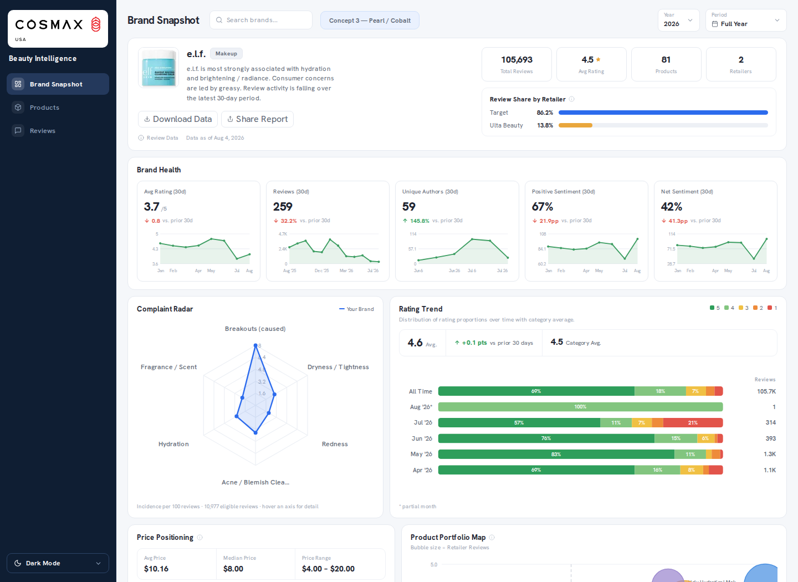
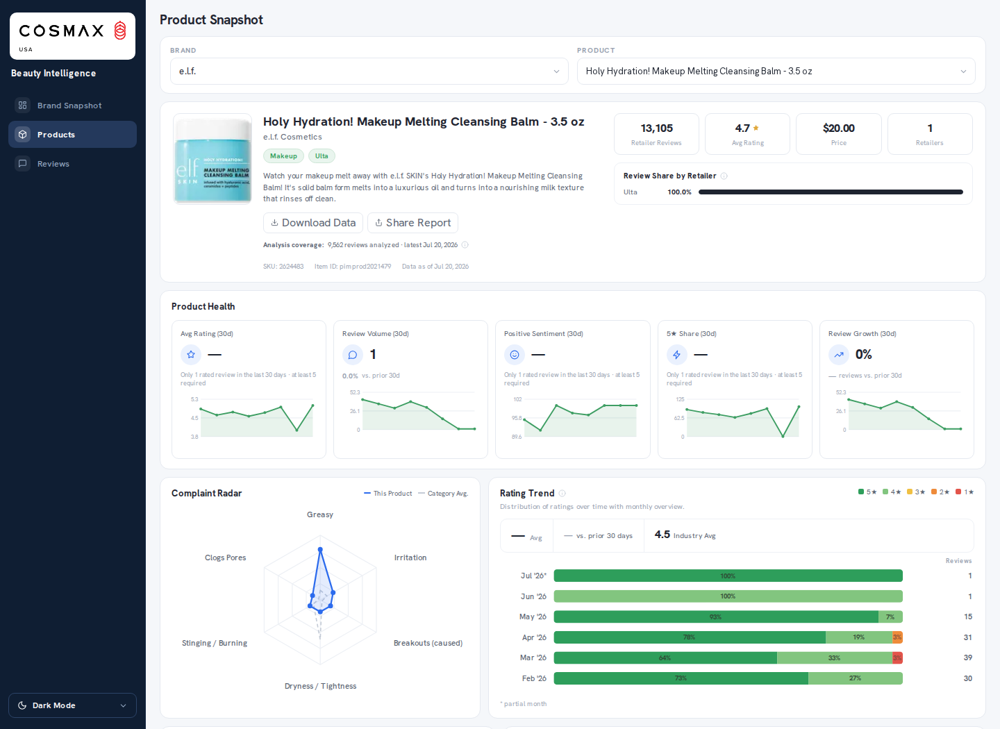
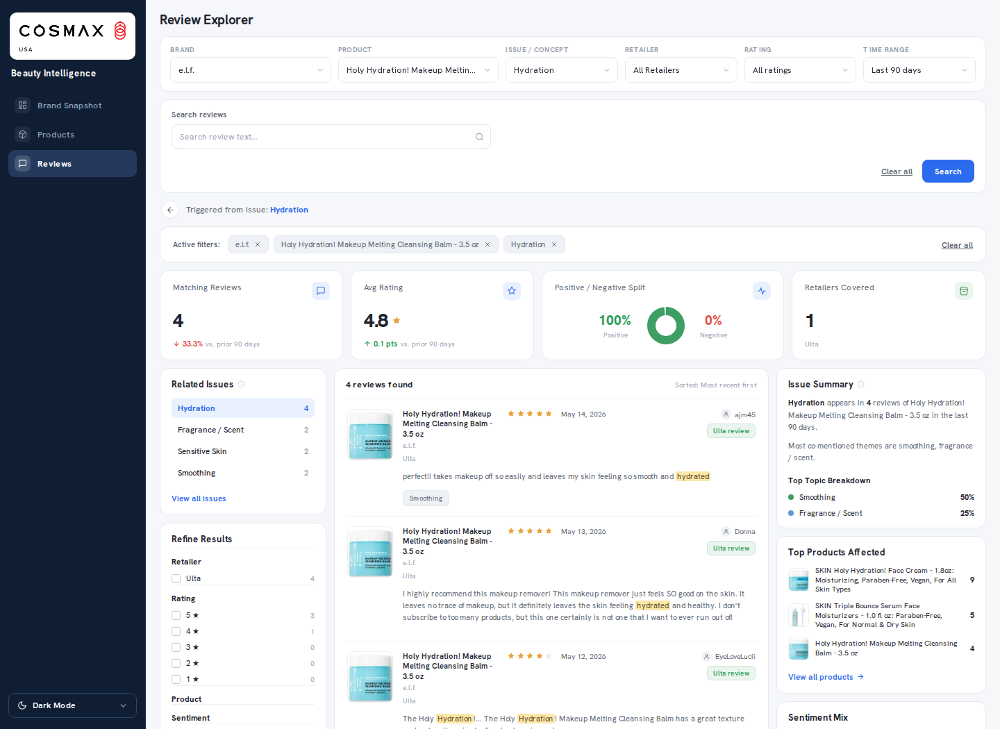

# Beauty Intelligence

**NLP / Information Extraction · Taxonomy Engineering · Consumer Analytics · Human-Ground-Truth Evaluation · Time-Series Intelligence · Data Products**

[← Portfolio home](../../README.md) · [Live product](https://beauty-intelligence-seven.vercel.app)

Beauty Intelligence is a production analytics product that turns noisy consumer reviews into structured, decision-ready intelligence for brands and product teams.

The central DS question is not “can I run sentiment analysis?” It is: **how do I define stable semantic concepts, extract evidence correctly, build trustworthy denominators, create human ground truth, and translate unstructured language into business metrics without overstating quality?**

---

## 30-second hiring scan

**Best-fit roles:** Data Scientist · Product Data Scientist · NLP / Applied Data Scientist · Analytics Engineer · Consumer / Market Intelligence roles

**Core skills demonstrated:**

`Information Extraction` · `Multi-Label Concept Tagging` · `Taxonomy / Ontology Design` · `Negation & Context Handling` · `Human-in-the-Loop Evaluation` · `Stratified Sampling` · `Macro-F1` · `Span IoU` · `Time-Series Analytics` · `Metric / Denominator Design`

**What makes it more than a dashboard:** the semantic engine is versioned, evaluated against blind human labels, persisted into an analytics-ready data layer, and served through production brand/product workflows with explicit low-sample and failure states.

---

## Product evidence

These screenshots were captured from the **live production product**, not from the older screenshot folder in the private source repository.

### Production Brand Snapshot



*The current production Brand Snapshot brings review coverage, retailer mix, brand health, complaint incidence, rating distribution, price positioning, and product-portfolio signals into one decision surface.*

### Product Snapshot



*Product-level analysis carries the same evidence model into product health, complaint radar, retailer coverage, rating trends, review momentum, and real-review voices.*

### Review Explorer



*The Review Explorer links summary metrics back to filterable review evidence, related issues, retailer/rating facets, and searchable consumer language.*

Together these production surfaces show the analytical chain: **review evidence → semantic extraction → governed metrics → brand/product analytics → decision-facing production UI**.

## End-to-end DS workflow

```text
retailer product + review data
            ↓
normalization / identity resolution
            ↓
domain taxonomy
            ↓
offline semantic tagging
            ↓
concept + evidence + sentiment + assertion
            ↓
persisted semantic layer
            ↓
time-series + denominator rollups
            ↓
brand / product intelligence
            ↓
human-ground-truth evaluation + error analysis
            ↓
production B2B analytics product
```

The engine is designed so analytics pages consume **persisted semantic evidence** rather than rerunning text interpretation on every request.

---

## Data Science techniques used

| Area | Technique | How it is used |
|---|---|---|
| **NLP / Information Extraction** | Multi-label concept extraction | One review can express multiple benefits, complaints, product attributes, and usage experiences |
| | Evidence-span extraction | Every semantic output can retain the text span that supports it |
| | Phrase / context matching | Multi-word and contextual patterns reduce naive keyword matching |
| | Negation handling | Separates “not irritating” from “irritating” |
| | Assertion state | Distinguishes asserted experience from expectation or speculation |
| | Sentiment classification | Concept-level positive / negative orientation where supported |
| **Semantic Modeling** | Taxonomy / ontology design | Consumer language is mapped into stable concept + dimension definitions |
| | Versioned concept schema | Semantic definitions are frozen so changes can be evaluated instead of silently redefining metrics |
| | Domain-specific semantics | Beauty-specific meanings such as hydration, wear, irritation, pores, application, and texture are handled explicitly |
| **Evaluation Design** | Human Ground Truth | Blind human labels are the authority for semantic-accuracy measurement |
| | Blind Annotation | Annotators do not see engine predictions while labeling |
| | Stratified Sampling | Representative cohort sampled proportionally across platform × rating |
| | Challenge Sets | Hard linguistic cases measured separately rather than mixed into the headline cohort |
| | Span Alignment | Human and engine mentions matched by concept + evidence overlap |
| | Intersection over Union | Measures evidence-span quality |
| | Macro-F1 | Evaluates class quality without letting majority classes dominate |
| | Confusion Matrices | Makes per-class failure modes visible |
| | Strict End-to-End Metric | Requires concept + span + sentiment + assertion to all be correct |
| **Analytics Engineering** | Review-level denominators | Product/brand shares use reviews rather than raw mention counts when the claim is review-based |
| | Distinct-review counting | Repeated mentions do not silently multiply a reviewer’s weight |
| | Support thresholds | Low-sample metrics surface as limited / unavailable rather than false precision |
| | Typed availability states | Query failure, true zero, no-data, and low sample remain distinct |
| **Time-Series Analytics** | Monthly concept rollups | Semantic signals aggregated into brand/category/global histories |
| | Emerging-signal analysis | Recent movement compared with historical context |
| | Dirty-window recomputation | Incremental updates rebuild only affected windows |
| **Decision Systems** | Complaint ranking | Complaint concepts ranked from persisted evidence with minimum-support requirements |
| | Comparable-peer selection | Benchmark peers chosen under deterministic eligibility/comparability rules |
| | Product-family aggregation | Variants reconciled so analysis does not depend on one arbitrary SKU |
| **Data Engineering** | Multi-source ingestion | Retailer reviews normalized into one analytical layer |
| | Incremental tagging | New/changed reviews processed without recomputing the entire corpus |
| | Idempotent recovery | Retries and recovery paths avoid duplicating analytical state |
| | Regression testing | Denominator, drift, read-failure, and semantic-contract bugs become tests |
| **Production Governance** | V2 / V3 side-by-side tables | Challenger semantic outputs isolated from incumbent data |
| | Feature gating | New reads enabled only under explicit authorization |
| | Rollback boundaries | New engine version can be disabled without rewriting the prior engine’s state |

---

## Why taxonomy engineering is a DS problem

Review analytics becomes unreliable when the semantic categories themselves drift.

Beauty Intelligence therefore treats taxonomy as a **versioned feature-representation layer**, not a loose keyword list.

A concept definition must answer:

- What language counts as evidence?
- What should not count even if the same word appears?
- Is the statement positive, negative, neutral, negated, expected, or speculative?
- Is the phrase about product performance or a different word sense?
- Can the same rule be applied consistently across retailers and time?

Downstream complaint rates, product strengths, trend charts, and brand comparisons are only as trustworthy as this text-to-concept representation.

This demonstrates **feature representation for unstructured data, domain modeling, semantic consistency, and ontology governance**.

---

## Human-ground-truth evaluation

A major design rule is:

> **An AI/model judging another semantic engine is not final human ground truth.**

The evaluation harness freezes a real-review sample and builds a blind annotation workflow. Predictions are hidden from annotators; cohort logic, evaluator behavior, taxonomy snapshot, annotation guide, and evaluation identity are versioned.

### Evaluation pipeline

```text
frozen real-review sample
          ↓
deterministic cohort construction
          ↓
representative cohort + challenge cohort
          ↓
blind annotation
(predictions hidden)
          ↓
human evidence / concept / sentiment / assertion labels
          ↓
span-aligned evaluator
          ↓
concept + span + sentiment + assertion metrics
          ↓
error slices + adjudication
```

### Representative vs challenge cohorts

**Representative cohort**  
Proportional stratified sample across platform × rating. This is the cohort intended to support a population-style accuracy estimate once labeling is complete.

**Challenge cohort**  
Targeted difficult language: negation, expectation/speculation, failed mitigation, matcher traps, ambiguous concepts, and star/text disagreement. These are reported as diagnostic slices rather than folded into the representative headline.

This is an important evaluation distinction: **diagnostic difficulty and population representativeness answer different questions**.

---

## Evaluation metrics

The evaluator does not collapse semantic quality into a single accuracy value.

### Concept detection

- mention-level overlap match;
- exact match;
- review-level concept-set agreement.

### Evidence quality

- exact span rate;
- mean **Intersection over Union (IoU)** between human and engine evidence spans.

### Sentiment / assertion

- accuracy;
- macro-F1;
- per-class metrics;
- confusion matrices.

### Strict end-to-end correctness

A prediction counts as fully correct only when **concept + evidence span + sentiment + assertion** all align.

### Error analysis

Performance can be sliced by linguistic failure mode instead of relying only on an aggregate score.

---

## Important evaluation disclosure

The portfolio does **not** claim human-validated semantic accuracy before the blind annotation program establishes it.

That restraint is intentional. Engineering quality, corpus coverage, and product usefulness do not automatically prove semantic precision.

Skills demonstrated here include **evaluation design, annotation protocol design, cohort construction, metric design, error taxonomy, and scientific restraint**.

---

## Persisted semantic layer

The product does not parse the entire review corpus on every dashboard request.

```text
review
  ↓
offline tagger
  ↓
concept mention
  ├─ concept identity
  ├─ evidence span
  ├─ sentiment
  └─ assertion / context
  ↓
persisted semantic tables
  ↓
brand / product / category / time-series analytics
```

This turns NLP output into an **analytics-ready semantic layer** with:

- deterministic downstream queries;
- auditable evidence;
- reproducible historical metrics;
- version-to-version comparisons;
- fast production serving;
- offline repairability.

---

## V2 → V3 engine evaluation

Review Intelligence V3 was built side-by-side rather than as an in-place rewrite.

The correct framing is:

**Versioned Engine Evaluation · Shadow Rollout · Side-by-Side Validation**

—not A/B testing, because users are not randomly assigned to semantic treatments.

This architecture demonstrates:

- challenger isolation;
- backward compatibility;
- schema versioning;
- feature gating;
- rollback design;
- evaluation before promotion.

---

## Denominator design — a core analytics skill

A metric can look mathematically precise while answering the wrong business question.

```text
complaint mentions / all mentions       ≠       reviews with complaint / eligible reviews
```

One verbose review can contain many mentions. If the product claim is review-level prevalence, raw mention counts are the wrong denominator.

The system therefore distinguishes:

- all collected reviews;
- rated reviews;
- reviews with semantic support;
- distinct platform + review identities;
- low sample;
- true no-data;
- read/query failure.

This is **metric semantics / analytics engineering**, and it is central to making the B2B product trustworthy.

---

## Business-facing analytical systems

Beauty Intelligence translates semantic evidence into workflows including:

- Brand Intelligence;
- Product Intelligence;
- Complaint Radar;
- Consumer Love / benefit signals;
- review evidence exploration;
- top concepts by brand/product;
- peer benchmarking;
- emerging-signal / trend context;
- product and category comparisons.

Two particularly useful DS examples:

### Complaint ranking

Complaint concepts are ranked from **pre-tagged persisted evidence** rather than rerunning NLP during each page request. This cleanly separates semantic interpretation, aggregation, and presentation.

### Peer benchmarking

Peers are chosen through deterministic eligibility and comparability rules. Missing data carries typed reasons so a failed read cannot appear as a real zero.

These demonstrate **ranking logic, cohort definition, business metric governance, and explainable analytical products**.

---

## Data collection & quality engineering

The semantic engine cannot be more trustworthy than the corpus feeding it.

Production collection logic therefore includes:

- explicit failure classes;
- bounded retry/backoff;
- failed identities remaining retryable instead of being marked complete;
- verified-zero logic rather than inferring zero from network failure;
- idempotent recovery runs;
- product-family identity reconciliation;
- regression tests built from real failure modes.

This connects **data quality engineering directly to downstream DS validity**.

---

## Interview-ready talking points

1. Why generic sentiment analysis was insufficient for product/manufacturing intelligence.
2. How taxonomy design becomes a feature-representation problem.
3. Why blind human annotation is required for defensible semantic evaluation.
4. Why representative and challenge cohorts must be reported separately.
5. Why evidence-span IoU matters when the system claims explainable evidence.
6. How the wrong denominator can damage business decisions even when the classifier is reasonable.
7. Why V3 was deployed side-by-side with V2 instead of rewriting production tables.
8. How “no signal,” “low sample,” and “query failed” are preserved as different analytical states.

---

## Skills summary

**NLP / Semantic DS:** Information Extraction · Multi-Label Concept Extraction · Taxonomy / Ontology Design · Negation Handling · Context Disambiguation · Sentiment Analysis · Assertion Classification · Evidence Extraction

**Evaluation:** Human-in-the-Loop Evaluation · Blind Annotation · Stratified Sampling · Challenge Sets · Span Matching · Intersection over Union · Macro-F1 · Confusion Matrices · Error Analysis · Adjudication Workflows

**Analytics:** Time-Series Aggregation · Trend Detection · Complaint Ranking · Cohort Design · Peer Benchmarking · Metric Semantics · Denominator Design · Support Thresholds

**Data Engineering:** Python · SQL · PostgreSQL / Supabase · Incremental ETL · Idempotency · Data Quality Testing · Multi-Source Ingestion · Recovery Pipelines · Data Lineage

**Production:** Engine Versioning · Feature Gating · Side-by-Side Validation · Rollback Design · Next.js · TypeScript · Vercel · CI/CD

The full production source remains private. This public case study documents the DS methodology and product reasoning without publishing the complete semantic engine, proprietary review corpus, internal operational files, or production credentials.
